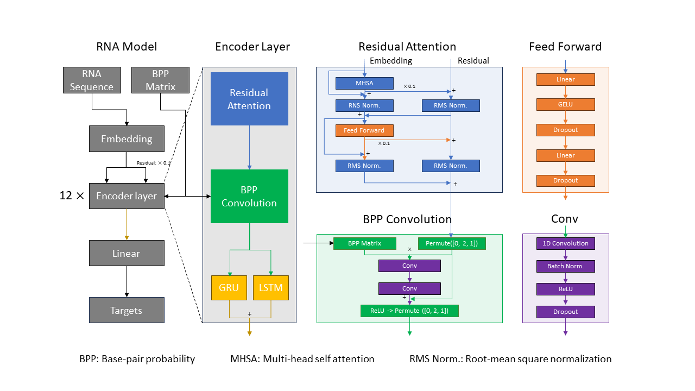

# 2023-Stanford-Ribonanza-RNA-Folding
This repository <b>Junseong's part in the 5th place solution</b> of [the Stanford Ribonanza RNA Folding competition 2023](https://www.kaggle.com/competitions/stanford-ribonanza-rna-folding/overview). Training was conducted on one GeForce RTX 4080 GPUs. The result of the 10-fold + 1 model in 100-fold ensemble models was as follows.  
Public leaderboard: 0.13947  
Private leaderboard: 0.14285

Our team's (R.L.J) solution [here](https://www.kaggle.com/competitions/stanford-ribonanza-rna-folding/discussion/460250).

# Summary

* <b>Model:</b> Transformer + 1D Conv Residual BPP attention + GRU + LSTM


# File Description
```
├── data
│   ├── train_data_processed_ALL_2.parquet (train dataset)
│   ├── test_sequences_processed_ALL.parquet (test dataset)
│   ├── submission_for_pseudo_v2.parquet (pseudo dataset)
|   ├── train_sparse_bpps
|   ├── test_sparse_bpps
├── exp
│   └── trainer.py
├── main
│   ├── bottle.py
│   ├── data.py
│   ├── modules.py
│   └── utils.py
└──  eda.ipynb
```
  
  
# How to use?
### 1. Clone this repository  
```
git clone https://github.com/JunSeongLee1102/2023-Kaggle-Stanford-Ribonanza-RNA-Folding
cd 2023-Kaggle-Stanford-Ribonanza-RNA-Folding
```
### 2. Download the dataset
```
Link: 
https://www.kaggle.com/datasets/junseonglee11/stanford-ribonanza-rna-folding-5th-place-dataset
Kaggle dowload API command: 
kaggle datasets download -d junseonglee11/stanford-ribonanza-rna-folding-5th-place-dataset
```
### 3. Set the Docker image
```
sudo docker run --gpus all -it --rm -d --shm-size=[Shared memory GB]G -v [Your root directory]:/workspace junseonglee1102/ngc-custom:xformer-tmux
```
Docker file link: https://hub.docker.com/layers/junseonglee1102/ngc-custom/xformer-tmux/images/sha256-c98a8b37c2134b268056f5a77797b8f7e847938530d1fa603a4e1422153e1ada?context=repo  
You can add -v [dataset path] argument to the docker run command if you want to use extra storage device.

### 4. Pseudo label pretraining
Set the <b>pretraining = False</b> in the trainer.py and 
```
cd exp
python trainer.py
```
### 5. Finetuning
Set the <b>pretraining = True</b> in the trainer.py and   
Set the load_ckpt path to you're pretrained checkpoint path.
```
cd exp
python trainer.py
```
# Inference
Set the value of the only_pred parameter to integer (n) to use nth directory's checkpoints in the log_dir.

# Model parameters
### settings
- debug: n steps to run for debug (0 for training)
- n_workers: dataloader workers
- pred: toggle predict test
- only_pred: use nth directory's checkpoints in the log_dir
- ckpt: toggle checkpoint
- early_stop: n epochs of no improvement before stop
- n_trial: limit numer of trials to run (0 == no limit)
- run_folds: list of fold_id's to run
- metric: metric to monitor for early stop and ckpt
- pretraining: modify paths and merge train/test dataframe to do pretraining

### hp
- n_epochs: # of epochs to train
- lr: max lr in inverse square root sched
- lr_warmup: warmup %
- wt_decay: weight decay excluding certain layers like norm
- grad_clip: gradient clip (norm) to prevent divegence
- batch_size: batch_size. !!!Caution!!! make sure that effective batch size is batch_size * N_GPUS * n_grad_accum
- n_grad_accum: number of batches to accumulate gradient
- n_mem: whether to use mem in the module's EncoderLayer
- sn_min: min sn for data inclusion (2A3 & DMS)
- stochastic_weight_average: activate stochastic weight averaging callback
- aux_loop: whether to use auxiliary loop data for training
- aux_struct: whether to use auxiliary struct data for training
- aux_scale: scale factor for the auxiliary multi-task training
- aux_smooth: label smoothing of for the auxiliary labels
- p_flip: probability to flip the sequences and matrices for augmentation or TTA (test-time augmentation, 0.0 or 0.5)
- emb_grad_frac: embedding grad multi float (0 < f <= 1) (1 disables)
- norm_layout: layout of norm in transformer layer
- pos_bias_heads: number of heads to apply pos bias, 0 disables
- pos_bias_params:
- pos_rope: adds rotary embedding
- pos_sine: adds sine embedding
- norm_rms: use rms norm instead of layer
- norm_lax: norm(x) becomes norm(x/x.max())
- qkv_bias: add bias to qkv layers in attention
- ffn_bias: add bias to ffn layers in attention
- ffn_multi:
- n_layers: number of attention blocks in the transformer
- n_heads: number of heads in the multi-head attention layer
- d_heads: dimension of the embeddings of each head
- p_dropout: global dropout probability
- att_fn: torch or xformers attention fn
- n_folds: n_folds-fold split
- seed: seed value for random 
- note: note
- n_layers_lstm: number of RNN layers in the EncoderLyaer block
- n_gru_heads: number of heads of the parallel RNNs (similar to multi-head attention)
- kernel_size_gc: kernel size of the convolution layers
- use_lenmatched_batch: apply length-matched sampling to reduce padding overhead (might decrease performance 0.001 + 10 % speed +)
- val_flip: bidirectional vaidation when training (need when p_flip = 0.5)
- tta_flip: bidirectional inference to improve perforamnce (must be used with )

# Reference
I started developing this repository from the Roger's repository [@sroger's code](https://github.com/s-rog/StanfordRibonanza2023).

